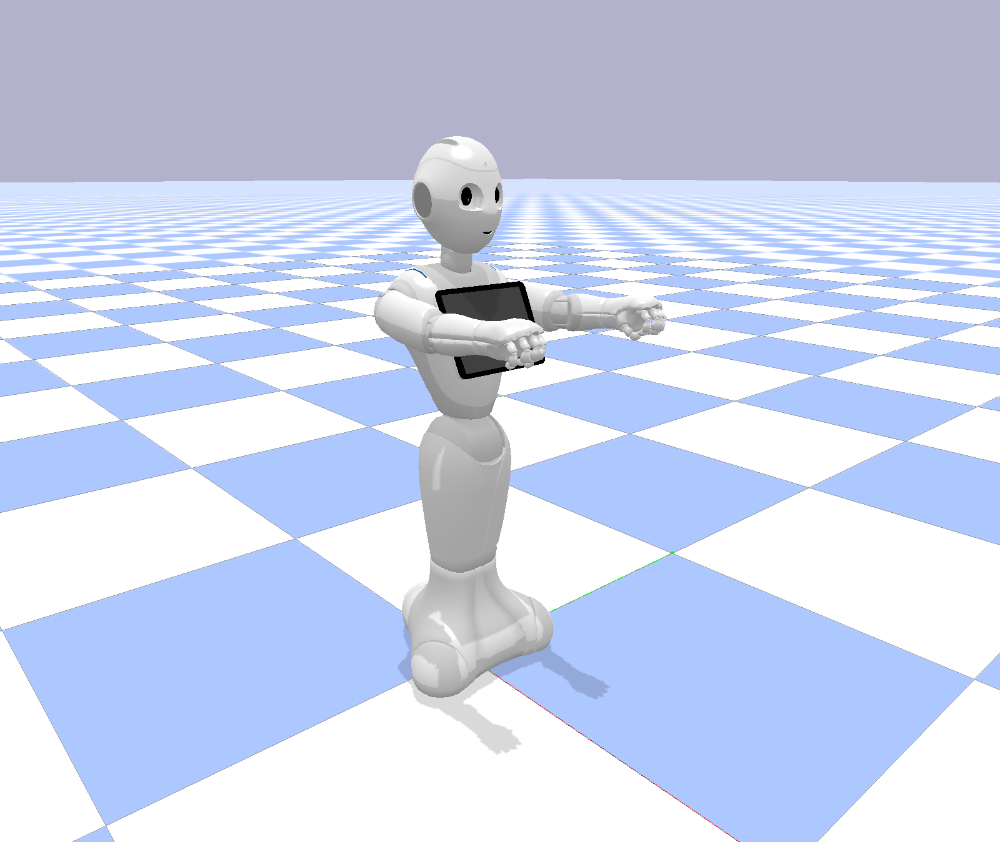
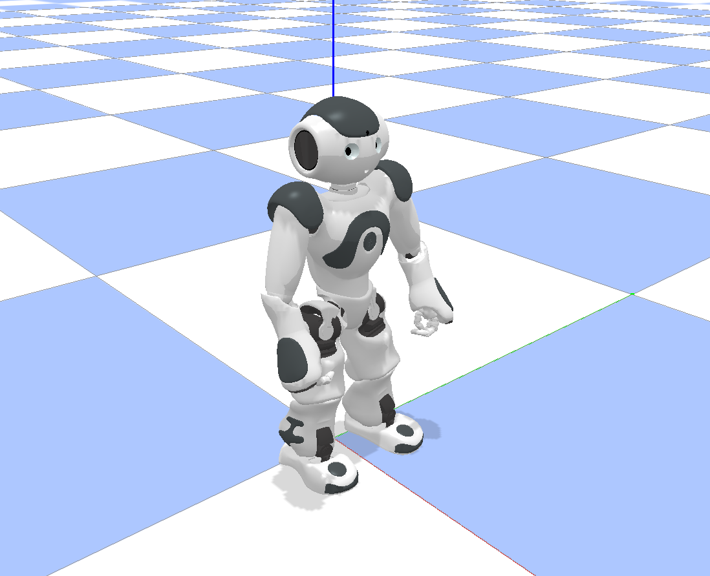

# humanoid-gym
gym env for humanoid robots including Pepper &amp; NAO with pybullet



## Installation

```bash
$ git clone git@github.com:0aqz0/humanoid-gym.git
$ cd humanoid-gym
$ pip install -e .
```

## Usage

```python
import gym, humanoid_gym
import pybullet as p

env = gym.make('pepper-v0')

while True:
    env.render()

    actions = env.action_space.sample()

    observation, reward, done, info = env.step(actions)
```

## References

- [PyBullet Quickstart Guide](https://docs.google.com/document/d/10sXEhzFRSnvFcl3XxNGhnD4N2SedqwdAvK3dsihxVUA/edit#heading=h.p3s2oveabizm)

- [qibullet](https://github.com/softbankrobotics-research/qibullet)